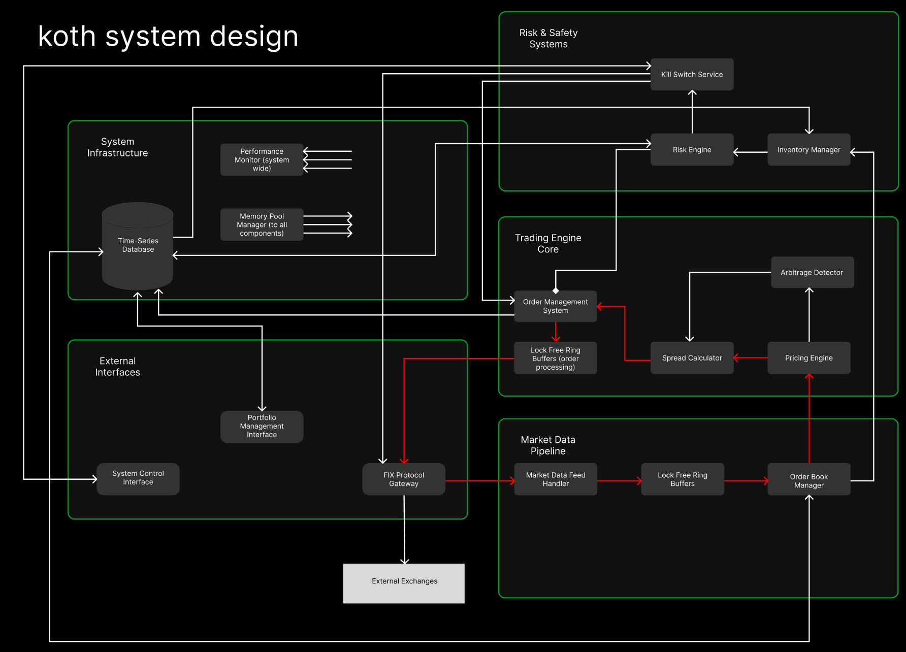

# koth (king of the hill) - ultra-low latency trading engine

## overview
the goal of koth is a high-performance algorithmic trading system designed for market tracking
arbitrage strategies. built in c++ with sub-10 microsecond latency targets,
it demonstrates enterprise-grade trading infrastructure suitable for institutional
environments.

the current state is more a beginner learning how to build an hft.

## system goals
- ultra-low latency order execution (<10us order-to-market)
- real-time market making with dynamic spread calculation
- cross-venue arbitrage detection and execution
- comprehensive risk management with emergency controls

## high level architecture
- market data ingestion via fix protocol
- lock-free data structures for zero-copy processing
- real-time risk engine with kill switch capabilities
- memory-mapped storage for consistent performance

## current status
- market data order book intial cut done 8/31/25

## documentation
- [assumptions](docs/assumptions.md) - assumptions tracking document

## architecture diagram

