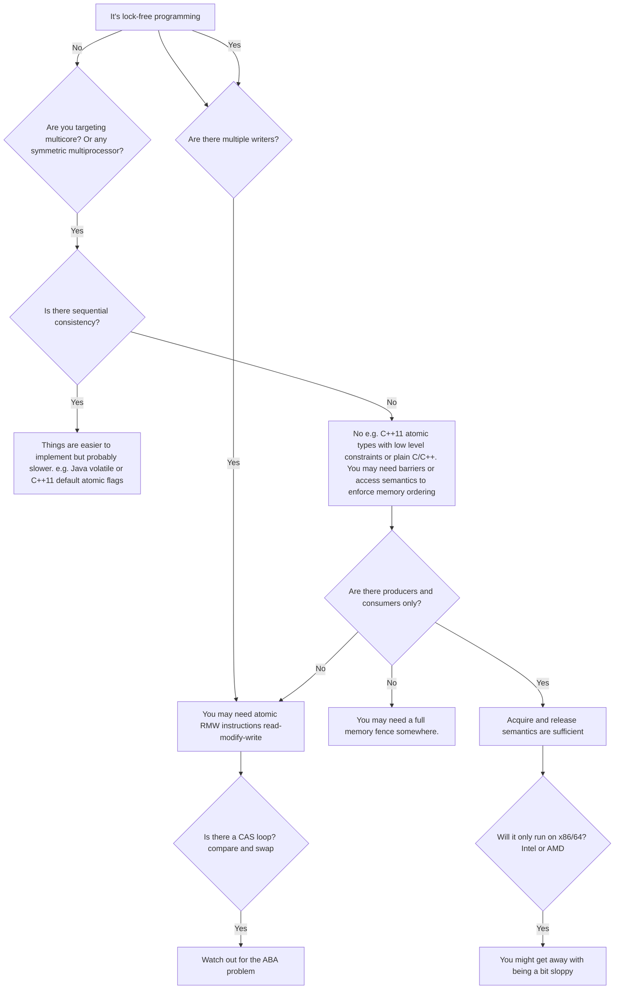

A standard definition of Lock free programming is programming without mutexes. However, it is more nuanced. If your section of code satisfies the below conditions, it is lock free, otherwise it is not:
- Are you programming with multiple threads? (or interrupts, signal handlers, etc) => if yes go to next bullet.
- Do the threads access shared memory? => if yes go to next bullet
- Can the threads block each other? (is there some way to schedule the threads which would lock up forever?) => if no, its lock free programming.

That is, if there is even the possibility of 'locking up the application,' in deadlock, livelock, or due to hypothetical thread scheduling decisions made by your worst enemy. Meaning if you were using mutexes acessing shared memory, and one thread obtained that lock, your worst enemy couldn't even schedule that thread while it has the lock.

Note, if you ever suspend a thread in lock free, it will never interfere with other threads completion. Also note, operations that are designed to block do not disqualify the algorithm, that is, a queue's pop operation may intentionally block when the queue is empty. The remaining codepaths can still be considered lock free.

### Techniques

Some common techniques in lock free programming are atomic operations, memory barriers, avoiding the ABA problem, among others.



### Atomic Read-Modify-Write Operations
Atomic operations manipulate memory in a way that appears indivisible: No thread can observe the operation half-complete. On modern processors, lots of operations are already atomic. RMW operations go a step further so we can do more complex things atomically.

They are effective when you need multiple writers, because multiple threads trying to operate on the same address, if they send RMW commands, those commands will line up and execute sequentially.

**The C++11 atomic standard does not guarantee implementation is lock free on every platform, so check. Confirm this is still the case in C++23, and use std::atomic<>::is_lock_free to be certain.**

Different CPUs support RMW in different ways, some expose load-link/store conditional instructions which allow you to implement your own RMW primitive at a low level, but this is not often done. Common RMW is usually sufficient.

### Compare-And-Swap CAS loops
Can be used to repeatedly attempt a transaction. One must take special care to avoid the ABA problem when using CAS.

### Sequential Consistency

Definition: All threads agree on the order in which memory operations occurred, and that order is consistent with the order of operations in the program source code.

```
std::atomic<int> X(0), Y(0);
int r1, r2;

void thread1()
{
	X.store(1);
	r1 = Y.load();
}

void thread2()
{
	Y.store(1);
	r2 = X.load();
}
```

In this snippet, r1 = r2 = 0 is impossible because C++11 adds extra commands or memory fencing under the hood to keep this operating as anticipated. These additional instructions may be less efficient than if the programmer has delt with memory ordering directly.

### Memory Ordering
When your environment does not guarantee sequential consistency, you must consider how to prevent meory reordering. 

There exists processor reordering and compiler reordering.
- Compiler reordering 
- Processor Reordering

A lightweight sync or fence instruction, a full memory fence instruction, or memory operations which provider acquire or release semantics are tools to enforce correct memory ordering.

Acquire semantics prevent memory reordering of operations which follow it in program order, and release semantics prevent memory reordering of operations preceding it. **These semantics are particularly suitable in cases with a consumer/producer relationship.**

### Source

https://preshing.com/20120612/an-introduction-to-lock-free-programming/

